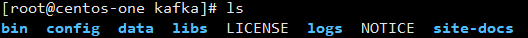

* content
{:toc}

# TODO
- [x] 技术背景
    - [x] 消息队列
    - [x] 模式
    - [x] 常见消息队列
- [x] 基本概念
    - [x] 简介
    - [x] 术语
- [ ] 操作使用
- [ ] 应用场景
- [ ] 深入理解

# 技术背景
## 消息队列
**消息队列(Message Queue)**
消息队列是一种==进程间通信==或同一进程的==不同线程间==的通信方式。当==不需要立即获得结果==，但是==并发量又需要进行控制==的时候，就是需要使用消息队列的时候，消息队列主要解决了应用耦合、异步处理、流量削锋等问题。
## 使用场景
- **应用耦合** ==多应用间==通过消息队列对==同一消息==进行处理，避免调用接口失败导致整个过程失败
- **异步处理** ==多应用==对消息队列中==同一消息==进行处理，应用间并发处理消息，相比串行处理，减少处理时间
- **限流削峰** 广泛应用于秒杀或抢购活动中，==避免流量过大==导致应用系统挂掉的情况
- **消息驱动的系统** 系统分为消息队列、消息生产者、消息消费者，生产者负责产生消息，消费者(==可能有多个==)负责对消息进行处理
## 消息队列模式
### 点对点模式
点对点模式下包括三个角色：
- 消息队列
- 发送者 (生产者)
- 接收者（消费者）


消息发送者生产消息发送到queue中，然后消息接收者从queue中取出并且消费消息。消息被消费以后，==queue中不再有存储==，所以==消息接收者不可能消费到已经被消费的消息==。
#### 特点
- 每个消息==只有一个接收者==(Consumer)(即一旦被消费，消息就不再在消息队列中)；
- 发送者和接收者间==没有依赖性==，发送者发送消息之后，不管有没有接收者在运行，都不会影响到发送者下次发送消息；
- 接收者在成功接收消息之后需向队列应答成功，以便消息队列删除当前接收的消息；
### 发布/订阅模式
发布/订阅模式下包括三个角色：
- 角色主题(Topic)
- 发布者(Publisher)
- 订阅者(Subscriber)


发布者将消息发送到Topic，系统将这些消息传递给==多个订阅者==。
#### 特点
- 每个消息可以有==多个订阅者==；
- 发布者和订阅者之间==有时间上的依赖性==。针对某个主题(Topic)的订阅者，它必须创建一个订阅者之后，才能消费发布者的消息。
- 为了消费消息，订阅者需要==提前订阅==该角色主题，并==保持在线运行==；
## 常用消息队列
- **RabbitMQ** RabbitMQ是使用==Erlang==编写的一个==开源==的消息队列，本身支持很多的协议：AMQP，XMPP, SMTP, STOMP，也正因如此，它非常==重量级==，更适合于企业级的开发。同时实现了Broker构架，这意味着==消息在发送给客户端时先在中心队列排队==。对路由，负载均衡或者数据持久化都有很好的支持。
- **Redis** Redis是一个==基于Key-Value对的NoSQL数据库==，开发维护很活跃。虽然它是一个Key-Value数据库存储系统，但它本身支持MQ功能，所以完全可以当做一个==轻量级==的队列服务来使用。Redis在入队数据大于10K的环境下入队表现非常差，出队速度不论数据大小则表现得非常好。
- **ZeroMQ** ZeroMQ号称最快的消息队列系统，尤其==针对大吞吐量的需求场景==。ZeroMQ能够实现RabbitMQ不擅长的高级/复杂的队列。ZeroMQ具有一个==独特的非中间件的模式==，你不需要安装和运行一个消息服务器或中间件，因为你的应用程序将扮演这个服务器角色。你只需要简单的引用ZeroMQ程序库，可以使用NuGet安装，然后你就可以愉快的在应用程序之间发送消息了。但是ZeroMQ==仅提供非持久性的队列==，也就是说如果宕机，数据将会丢失。
- **ActiveMQ** 是由Apache出品，ActiveMQ是一个==完全支持JMS1.1和J2EE 1.4规范==的JMS Provider实现。它非常快速，支持多种语言的客户端和协议，而且可以非常容易的嵌入到企业的应用环境中，并有许多高级功能
- **RocketMQ** 出自阿里公司的开源产品，用Java语言实现，在设计时参考了Kafka，并做出了自己的一些改进，==消息可靠性上比Kafka更好==。RocketMQ在阿里集团被广泛应用在订单、交易、充值、流计算、消息推送、日志流式处理、binglog分发等场景
- **Kafka** 一个分布式消息发布订阅系统。它最初由LinkedIn公司基于独特的设计实现为一个分布式的提交日志系统(a distributed commit log)，之后成为Apache项目的一部分。Kafka系统快速、==可扩展==并且==可持久化==。它的分区特性，可复制和可容错都是其不错的特性
- **Jafka** Jafka是在Kafka之上孵化而来的，即Kafka的一个升级版。具有以下特性：==快速持久化==，可以在O(1)的系统开销下进行消息持久化；高吞吐，在一台普通的服务器上既可以达到10W/s的吞吐速率；==完全的分布式==系统，Broker、Producer、Consumer都原生自动支持分布式，==自动实现负载均衡==；==内核非常小==，整个系统（包括服务端和客户端）只有一个272KB的jar包，内部机制也不复杂，==适合进行内嵌或者二次开发==
# 基本概念
## 简介
**Kafka**
Kafka是由LinkedLn开发并在Apache基金会开源的一个==流处理平台==，由Scala和Java编写。Kafka是一个==快速==、==可伸缩==、耐用的==分布式==发布和订阅消息系统，它可以处理消费者规模的网站中的所有动作流数据。 这种动作（网页浏览，搜索和其他用户的行动）是在现代网络上的许多社会功能的一个关键因素。 这些数据通常是由于吞吐量的要求而通过处理日志和日志聚合来解决。 对于像Hadoop的一样的日志数据和离线分析系统，但又要求实时处理的限制，这是一个可行的解决方案。Kafka的目的是通过Hadoop的并行加载机制来统一线上和离线的消息处理，也是==为了通过集群来提供实时的消息==。
同很多消息系统一样，Kafka把信息存储在Topic中。生产者(Producer)将数据写入Topic然后消费者(Consumer)从Topic中读取。因为Kafka是分布式系统，==Topic可以跨节点分区和复制==。
消息均为字节数组，开发者可以把他们存储成==任意对象及格式==，比如String，Json和Avro这些常用格式。也可以给每个消息添加Key，这样Producer可以确保同样Key的所有信息可以存储到同一个分区上。从一个Topic消费的时候，可以将多个Consumer建立成一个Consumer Group。Consumer Group中的每个Consumer将读取他们订阅的Topic分区的一个==子集==。也就是说每个消息会被传送给Group中的一个Consumer，包含同样Key的所有消息会被传送到同一个Consumer中。
Kafka独特的地方就是把每个Topic分区当成Log（一个==排序==的消息集）。分区中的每个消息被分配一个独一无二的位置。Kafka不会追踪哪些被Consumer读取的消息，只==保留未读消息==；相反Kafka保留所有消息集的时间，和Consumer负责追踪他们在每个日志的位置。因此Kafka可以用极小的开销支持大量的Consumer并保留大量数据。
## 术语
- **Topic** 主题。Kafka将消息种子(Feed)分门别类，==每一类==的消息称之为一个主题(Topic)
- **Producer** 生产者。==发布消息==的对象称之为主题生产者(Kafka topic producer)
- **Consumer** 消费者。==订阅消息==并处理发布的消息的种子的对象称之为主题消费者(consumers)
- **Consumer Group** 消费者组。每个Consumer都属于一个特定的Consumer Group(若==不指定Group，则属于默认的Group==)
- **Broker** 代理。==已发布==的消息保存在一组服务器中，称之为Kafka集群。集群中的每一个服务器都是一个代理(Broker)，消费者可以订阅一个或多个主题(topic)，并从Broker拉数据，从而消费这些已发布的消息。==一个Broker中保存了一个或多个Topic==
- **Log** 日志。
- **Partition** 分区。Topic在物理存储层面的分组，一个Topic由==多个==Partition组成，每一个Partition都是一个==有序队列==
- **Offset** 偏移量。每一个Partition都是一个==有序的不可变队列==。Partition中的每一个消息都被编了一个==唯一==的序列号，称为偏移量
# 安装使用
> 本文使用的Kafka版本为`2.12-1.1.1`
## 下载
可以从Apache Kafka主页下载到想要的版本：[Kafka Download](https://kafka.apache.org/downloads)
## 安装
将下载好的Kafka压缩包`kafka_2.12-1.1.1.tgz`解压到文件夹，文件夹可以自行指定，我放在`/usr/local/`路径下
```shell
tar -zvxf kafka_2.12-1.1.1.tgz
mv kafka_2.12-1.1.1 /usr/local/
```
下面是Kafka安装文件目录的构成
- `bin` Kafka相关操作的可执行脚本文件
- `config`
- `data`
- `libs`
- `logs`
- `site-docs`
- `LINCENSE`
- `NOTICE`


### 单机
### 集群
## 配置
### Broker
### Topic
### Producer
### Consumer
### Streams
### Connect
### AdminClient
## 操作
### 添加修改Topic
### 修改删除Topic
### 彻底删除Topic
### 从老版本升级Kafka
### 优雅的关闭
### 平衡Leader
### 镜像集群之间的数据
### 检查消费者的位置
### Kafka扩大集群
### 退役Broker
### 增加副本
### 在数据迁移期间限制带宽的使用
# 应用场景
## 消息
## 网站活动追踪
## 指标
## 日志聚合
## 流处理
## 事件采集
# 深入理解

